# details_showcase

<kbd>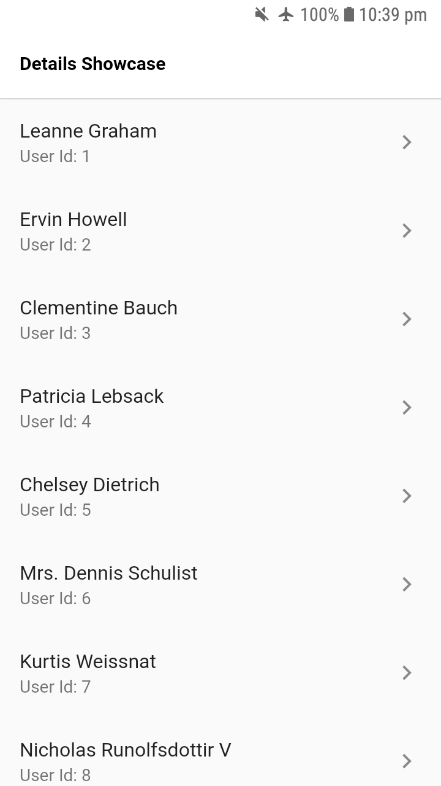</kbd>&emsp;<kbd>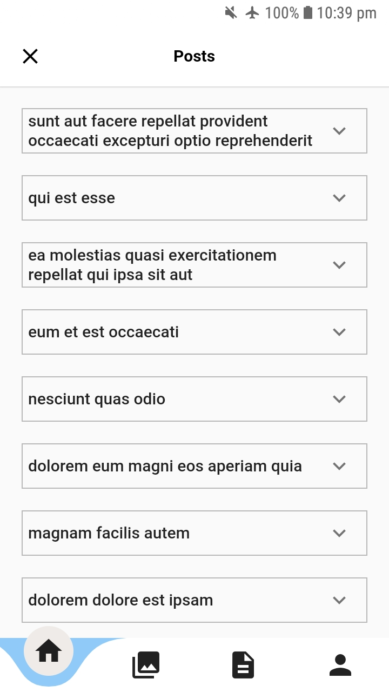</kbd>&emsp;<kbd>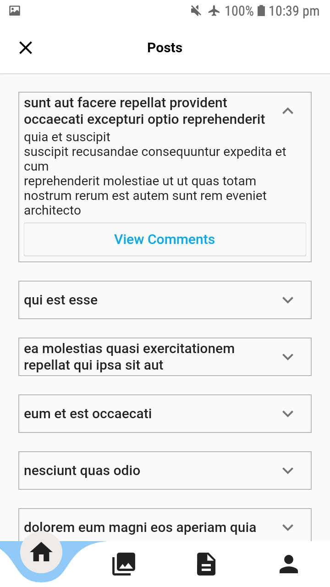</kbd>

<kbd>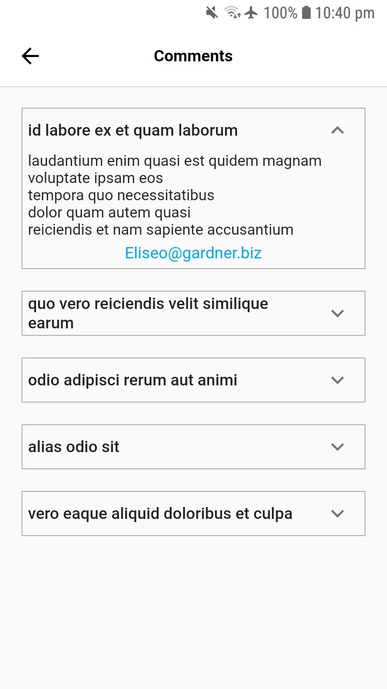</kbd>&emsp;<kbd>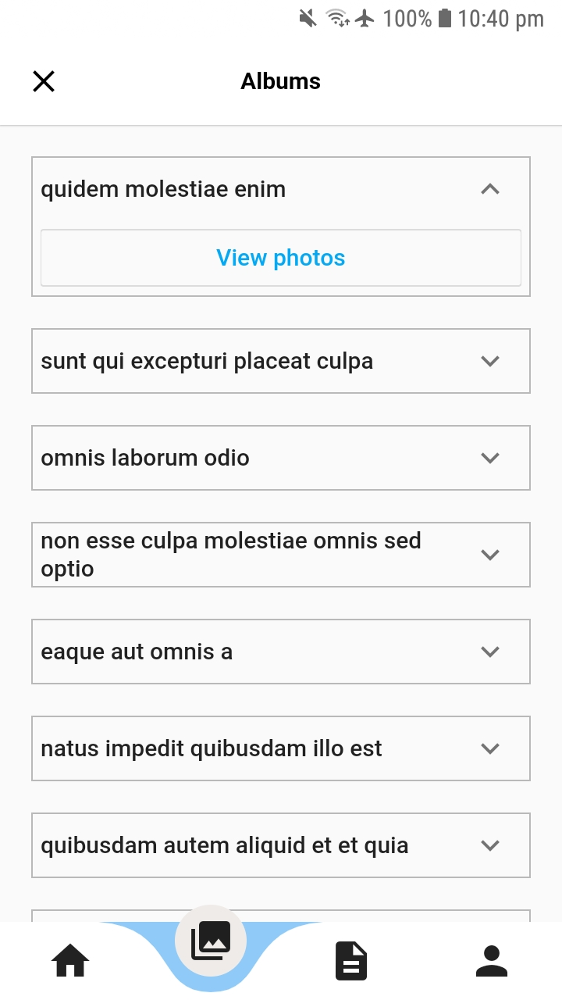</kbd>&emsp;<kbd>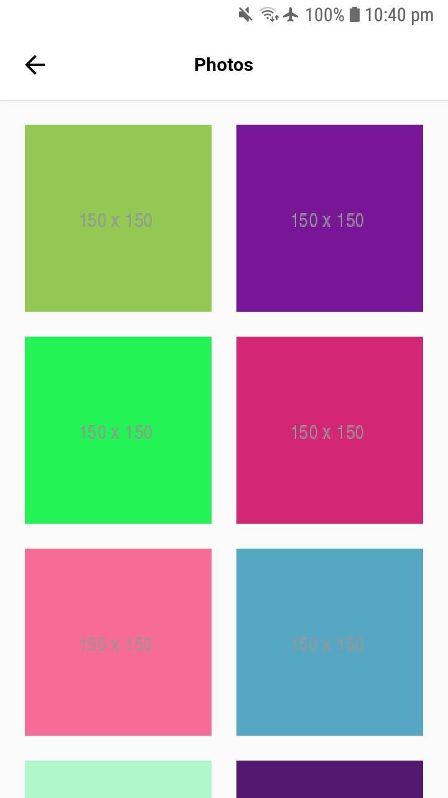</kbd>

<kbd>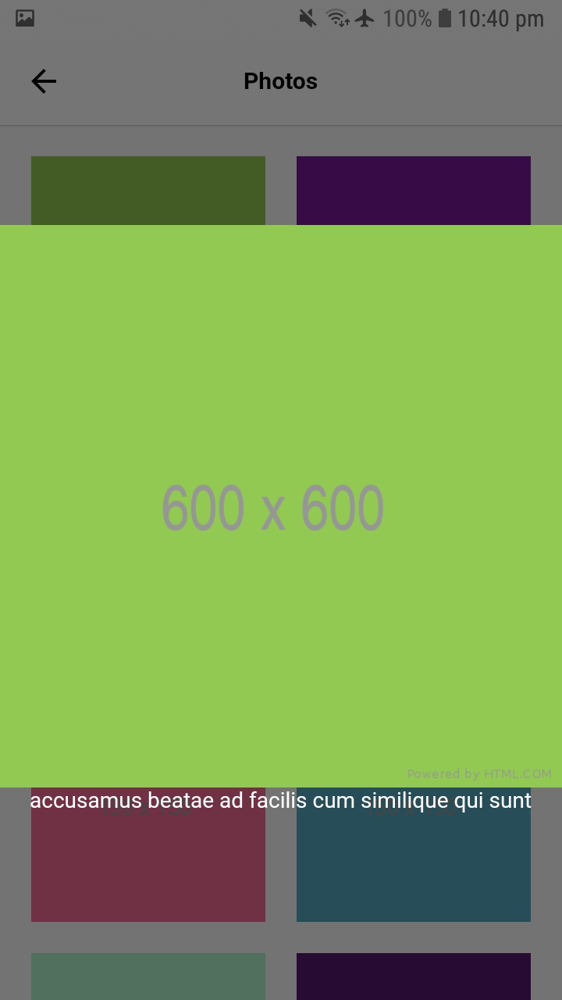</kbd>&emsp;<kbd>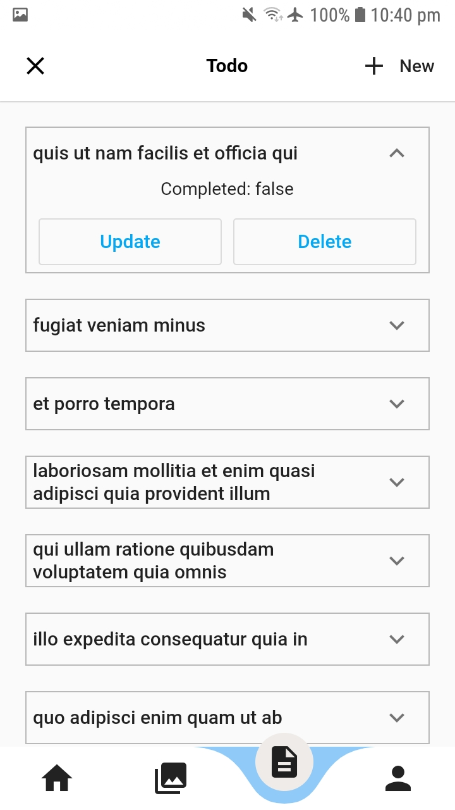</kbd>&emsp;<kbd>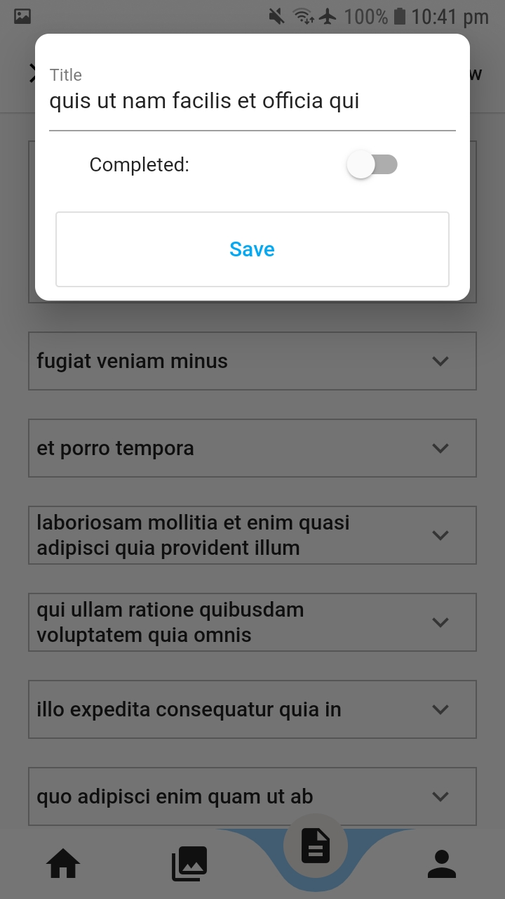</kbd>

<kbd></kbd>&emsp;<kbd>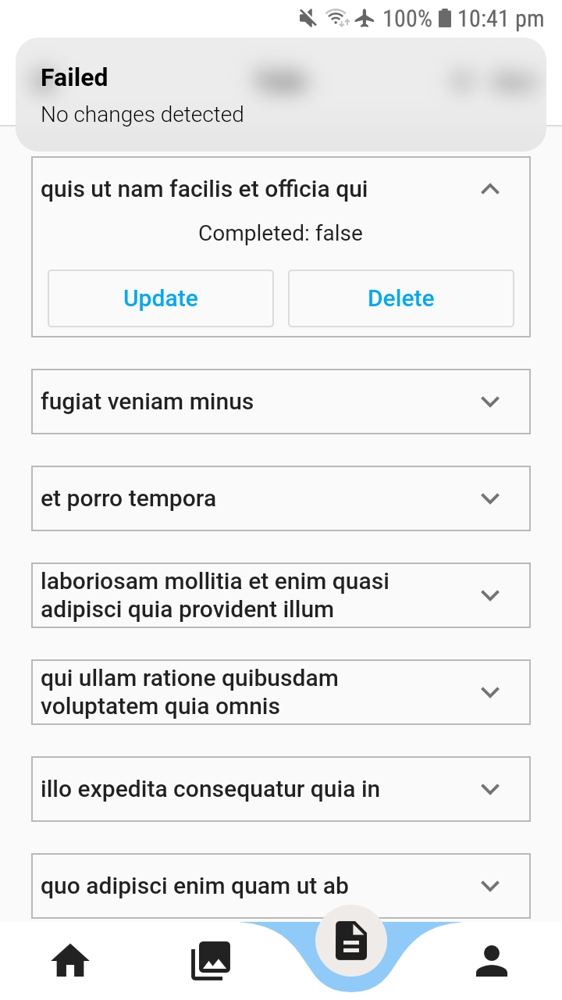</kbd>&emsp;<kbd>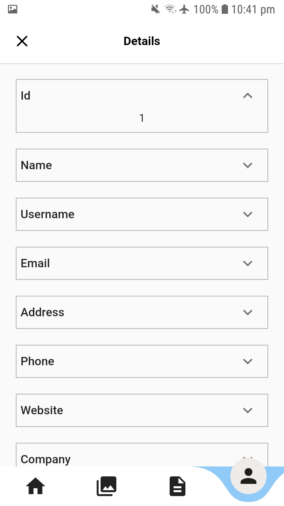</kbd>

<kbd>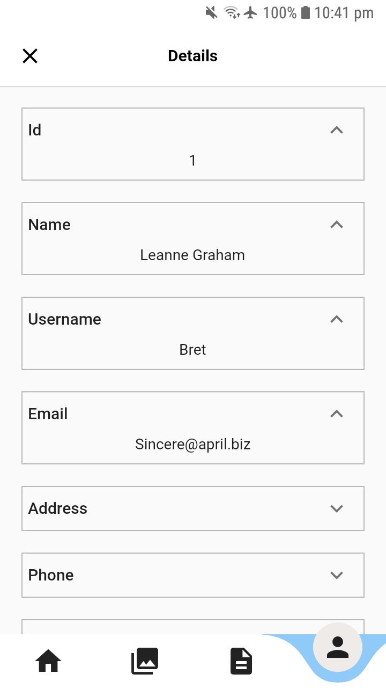</kbd>&emsp;<kbd>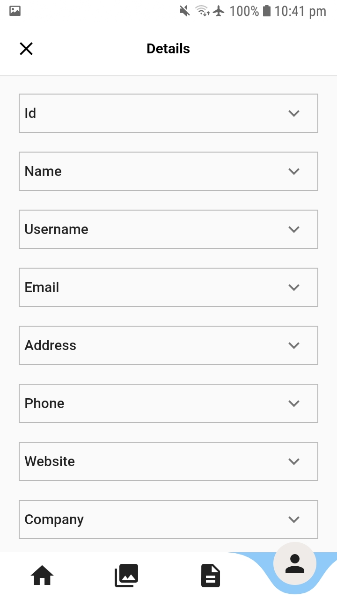</kbd>&emsp;<kbd>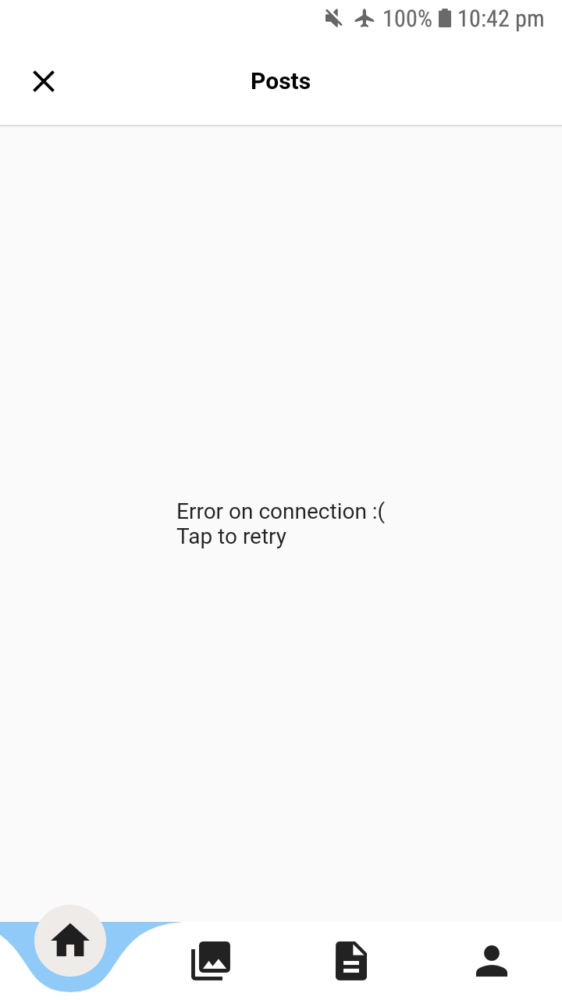</kbd>
